# 🎓 **AI & Data Science Portfolio**

<div align="center">

[](https://github.com/khachatryanDavid/AI-and-Data-Science-Portfolio)
[](https://www.python.org/)
[](https://pytorch.org/)
[](LICENSE)

*A curated collection of research-grade projects in Machine Learning, Deep Learning, and Data Science*

[**View Projects**](#-repository-structure) • [**Core Skills**](#-core-skills-demonstrated) • [**About Me**](#-about-me) • [**Contact**](#-connect-with-me)

</div>

---

## 📖 **Portfolio Overview**

Welcome to a **comprehensive journey** through Artificial Intelligence and Data Science. This portfolio represents hundreds of hours of rigorous study, experimentation, and implementation — transforming theoretical knowledge into practical, production-ready solutions.

Every project here reflects:
- **Deep theoretical understanding** backed by mathematical rigor
- **Clean, reproducible code** with extensive documentation
- **Real-world problem-solving** with measurable results
- **Research-level clarity** in explanations and visualizations

### 🎯 **Mission Statement**

> *"To bridge the gap between theoretical AI and practical applications, building intelligent systems that don't just work — but are understood, explainable, and improvable."*

This portfolio is not just a collection of code — it's a **demonstration of analytical thinking**, **algorithmic reasoning**, and the ability to transform complex problems into elegant solutions.

---

## 🗂️ **Repository Structure**

Each directory represents a complete, production-ready project with theoretical background, implementation, and comprehensive analysis.

### 📊 **Data Science & Analytics**
```
DS/
├── Exploratory_Analysis/     → Statistical analysis, hypothesis testing
├── Feature_Engineering/      → Advanced preprocessing techniques
├── Visualization_Projects/   → Interactive dashboards and insights
├── Time_Series_Analysis/     → Forecasting and trend detection
└── A_B_Testing/             → Experimental design and statistical inference
```

**Focus:** Turning raw data into actionable insights through statistical rigor and visual storytelling.

---

### 🤖 **Classical Machine Learning**
```
Machine_Learning/
├── Regression_Models/        → Linear, Polynomial, Regularized Regression
├── Classification/           → Logistic Regression, SVM, Decision Trees
├── Ensemble_Methods/         → Random Forest, XGBoost, AdaBoost, Stacking
├── Clustering/              → K-Means, DBSCAN, Hierarchical, Gaussian Mixture
├── Dimensionality_Reduction/ → PCA, t-SNE, UMAP, Autoencoders
└── Model_Selection/         → Cross-validation, Hyperparameter tuning, Grid Search
```

**Focus:** Building robust ML pipelines from data preprocessing to model deployment.

---

### 🔥 **Deep Learning & Neural Networks**
```
PyTorch/
└── neural-networks/
    ├── notebook1.ipynb      → Baseline 2-layer NN | BCE Loss | 17 params
    ├── notebook2.ipynb      → Scaled 3-layer NN | MSE Loss | 26 params | 71% improvement
    └── notebook3.ipynb      → Regularized NN | L2 Weight Decay | 43 params | Bias-variance analysis
```

**Key Experiments:**
- **Loss Function Comparison:** BCE vs MSE for binary classification
- **Scaling Strategy:** Impact of data size and model capacity
- **Regularization Effects:** L2 weight decay trade-offs

**Results:** Achieved 71% performance improvement through strategic architecture scaling and loss function optimization.

---

### 🧮 **Mathematical Foundations**
```
Mathematics_for_ML/
├── Optimization/            → Gradient Descent variants, Newton's Method, Conjugate Gradient
├── Linear_Algebra/          → Matrix decompositions, Eigenvalues, SVD
├── Probability_Theory/      → Distributions, Sampling, Monte Carlo methods
├── Bayesian_Methods/        → MLE, MAP, Bayesian Inference, MCMC
└── Information_Theory/      → Entropy, KL Divergence, Mutual Information
```

**Focus:** Understanding the mathematical machinery that powers AI algorithms.

---

### 🎨 **Computer Vision** *(Coming Soon)*
```
Computer_Vision/
├── Image_Classification/
├── Object_Detection/
├── Semantic_Segmentation/
└── GANs_and_Diffusion/
```

---

### 💬 **Natural Language Processing** *(Coming Soon)*
```
NLP/
├── Text_Classification/
├── Sentiment_Analysis/
├── Transformers/
└── LLM_Fine_Tuning/
```

---

## 📚 **Core Skills Demonstrated**

### 🔬 **Data Science & Analytics**
| Skill | Tools | Proficiency |
|-------|-------|-------------|
| Data Wrangling | Pandas, NumPy | ████████░░ 80% |
| Statistical Analysis | SciPy, Statsmodels | ███████░░░ 75% |
| Data Visualization | Matplotlib, Seaborn, Plotly | ████████░░ 85% |
| Feature Engineering | Domain expertise, Auto-FE | ███████░░░ 70% |
| A/B Testing | Hypothesis testing, Power analysis | ██████░░░░ 65% |

### 🤖 **Machine Learning**
| Algorithm Family | Implementation | Understanding |
|-----------------|----------------|---------------|
| Linear Models | Scikit-learn, Custom NumPy | ████████░░ 85% |
| Tree-based Models | XGBoost, LightGBM, CatBoost | ████████░░ 80% |
| Ensemble Methods | Bagging, Boosting, Stacking | ███████░░░ 75% |
| Clustering | K-Means, DBSCAN, Hierarchical | ███████░░░ 70% |
| Dimensionality Reduction | PCA, t-SNE, UMAP | ██████░░░░ 65% |

### 🧠 **Deep Learning**
| Concept | Framework | Mastery |
|---------|-----------|---------|
| Neural Network Architecture | PyTorch | ████████░░ 80% |
| Backpropagation & Optimization | Custom + PyTorch | ███████░░░ 75% |
| Loss Functions | BCE, MSE, Cross-Entropy | ████████░░ 85% |
| Regularization | L2, Dropout, Early Stopping | ███████░░░ 75% |
| Training Diagnostics | Loss curves, Overfitting detection | ████████░░ 80% |

### 📐 **Mathematical Foundations**
- **Calculus:** Derivatives, Gradients, Chain Rule, Optimization
- **Linear Algebra:** Matrix operations, Eigenvalues, SVD, Transformations
- **Probability:** Distributions, Bayes' Theorem, Maximum Likelihood
- **Statistics:** Hypothesis testing, Confidence intervals, Regression analysis
- **Optimization:** Gradient Descent, Newton's Method, Convex Optimization

---

## 🛠️ **Technology Stack**

### **Languages**


### **Deep Learning**


### **Machine Learning**


### **Data Science**


### **Development Tools**


---

## 🎯 **Project Highlights**

### 🏆 **Featured Project: Neural Network Training Dynamics**

**Problem:** Understanding how different loss functions and regularization techniques affect model performance and generalization.

**Approach:**
1. Built 3 progressively complex neural networks (17 → 26 → 43 parameters)
2. Compared BCE vs MSE loss functions
3. Tested L2 regularization impact on overfitting

**Results:**
- ✅ **71% improvement** switching from BCE to MSE with scaled architecture
- ✅ **Perfect train/val convergence** with L2 regularization (gap: 0.0005)
- ✅ **Zero overfitting** despite 2.5x parameter increase
- ⚠️ **Key insight:** Regularization is not always beneficial — discovered that L2 hurt performance when overfitting wasn't present

**Impact:** Developed intuition for when to apply regularization vs when to scale model capacity.

---

### 📊 **Data Science Methodology**

Every project follows a rigorous, research-grade workflow:

```mermaid
graph LR
    A[Problem Definition] --> B[Literature Review]
    B --> C[Data Collection & Cleaning]
    C --> D[Exploratory Analysis]
    D --> E[Feature Engineering]
    E --> F[Model Development]
    F --> G[Hyperparameter Tuning]
    G --> H[Evaluation & Validation]
    H --> I[Interpretation & Insights]
    I --> J[Documentation & Deployment]
```


**Quality Standards:**
- ✅ Reproducible code with fixed random seeds
- ✅ Comprehensive error handling and data validation
- ✅ Extensive inline documentation and markdown explanations
- ✅ Rigorous cross-validation and test set evaluation
- ✅ Visual diagnostics for every critical decision
- ✅ Clear interpretation of results with limitations discussed

---

## 🧠 **Philosophy & Approach**

### **Core Principles**

1. **Understanding over Implementation**
   > *"I don't just import libraries — I understand what happens when I call `.fit()`"*

2. **Mathematics as Foundation**
   > *"Every algorithm is backed by mathematical intuition. No black boxes."*

3. **Reproducibility & Transparency**
   > *"Every result can be verified. Every decision is documented."*

4. **Failure is Data**
   > *"Failed experiments teach as much as successful ones. All results are valuable."*

5. **Real-World Focus**
   > *"Toy datasets are for learning. Real problems are for proving mastery."*

---

## 📈 **Learning Journey**

### **Completed Milestones**
- [x] Master NumPy fundamentals and vectorized operations
- [x] Build neural networks from scratch (no frameworks)
- [x] Implement backpropagation manually
- [x] Understand loss functions deeply (BCE vs MSE comparison)
- [x] Apply regularization techniques (L2, Dropout)
- [x] Diagnose overfitting through loss curve analysis
- [x] Scale models strategically (data + capacity)

### **Current Focus (November 2025)**
- [ ] Convolutional Neural Networks (CNNs)
- [ ] Recurrent architectures (RNNs, LSTMs, GRUs)
- [ ] Attention mechanisms and Transformers
- [ ] Transfer learning and fine-tuning
- [ ] Generative models (VAEs, GANs)

### **Future Goals (2026)**
- [ ] Large Language Models (LLMs)
- [ ] Reinforcement Learning
- [ ] MLOps and model deployment
- [ ] Research paper implementations
- [ ] Open-source contributions

---

## 👤 **About Me**

<div align="center">

</div>

**David Khachatryan**  
*Junior Machine Learning Engineer | AI Researcher in Training*

### **Academic Pursuits**
- 🎓 Currently studying: **Machine Learning, Data Science, Calculus, Probability Theory, Statistics**
- 🎯 Goal: Admission to **MIT, Stanford, or Harvard** for AI/ML research
- 🔬 Research interests: **Optimization algorithms, Neural network interpretability, Mathematical foundations of AI**

### **What Drives Me**
I believe that true mastery comes from understanding **why** algorithms work, not just **how** to use them. Every line of code in this portfolio is backed by mathematical reasoning and experimental validation.

My approach:
- 📖 **Read the papers** that introduced the algorithms
- ✍️ **Implement from scratch** before using libraries
- 🧪 **Experiment rigorously** to build intuition
- 📊 **Document thoroughly** for future reference
- 🤝 **Share knowledge** to help others learn

### **Beyond Code**
- 🌟 Passionate about **Physics** and its connection to AI
- 🧩 Love solving complex problems that require creative thinking
- 🎓 Committed to **educational technology** and making AI accessible
- 🌍 Aspiring to contribute to **AI research** that benefits humanity

---

## 📬 **Connect With Me**

<div align="center">

[](https://www.linkedin.com/in/david-khachatryan-65a14b376/)
[](https://github.com/khachatryanDavid)

**Open to:** Research Collaborations | ML Internships | Academic Discussions | Open Source Contributions

</div>

---

## 📊 **Portfolio Statistics**

<div align="center">

| Metric | Count |
|--------|-------|
| **Total Projects** | 15+ |
| **Notebooks Completed** | 25+ |
| **Lines of Code** | 10,000+ |
| **Research Hours** | 500+ |
| **Topics Covered** | 30+ |
| **Models Trained** | 100+ |

</div>

---

## 🏆 **Key Achievements**

- 🎯 **71% performance improvement** through strategic loss function selection
- 🔬 **Zero overfitting** despite 2.5x model complexity increase
- 📈 **Perfect train/validation convergence** (0.0005 gap) using L2 regularization
- 🧪 **10+ rigorous experiments** comparing algorithms and techniques
- 📝 **Research-grade documentation** across all projects
- 🎓 **Self-taught** PyTorch, NumPy, and ML mathematics

---

## 📄 **License**

This portfolio is licensed under the **MIT License** - feel free to use the code for learning purposes with proper attribution.

---

## 🌟 **Acknowledgments**

This journey wouldn't be possible without:
- The **open-source ML community** for incredible resources
- **Stanford CS229**, **fast.ai**, and **3Blue1Brown** for educational content
- **PyTorch documentation** for clear, comprehensive guides
- Every researcher who published their work openly

---

## 📅 **Portfolio Timeline**

<div align="center">

| Period | Milestone | Focus Area |
|--------|-----------|------------|
| **October 2025** | 🎬 Portfolio Initiated | Machine Learning Foundations |
| **November 2025** | 🔥 Deep Learning Era | Neural Networks with PyTorch |

</div>

---

**🎯 Not just applying algorithms — understanding why they work.**

---

**🚀 Built with passion, powered by curiosity, driven by the pursuit of knowledge.**

---

📍 **Maintained by:** David Khachatryan  
📅 **Last Updated:** November 18, 2025  
⭐ **Version:** 1.1.0

---

<div align="center">

*If this portfolio demonstrates the level of dedication and skill you're looking for, let's connect!*

[](https://github.com/khachatryanDavid/AI-and-Data-Science-Portfolio)

</div>

---
# **Phrases**

<div align="center">

## **1. Machine Learning**

### 💡 *"Machine learning is the science of getting computers to learn without being explicitly programmed."*
*— Andrew Ng*

---
## **2. Data Science**
<div align="center">

### 💡 *"Without data, you're just another person with an opinion."*
*— W. Edwards Deming*

---
## **3. Neural Network**
<div align="center">

### 💡 *"The brain is a three-pound mass you can hold in your hand that can conceive of a universe a hundred billion light-years across."*
*— Marian Diamond*
